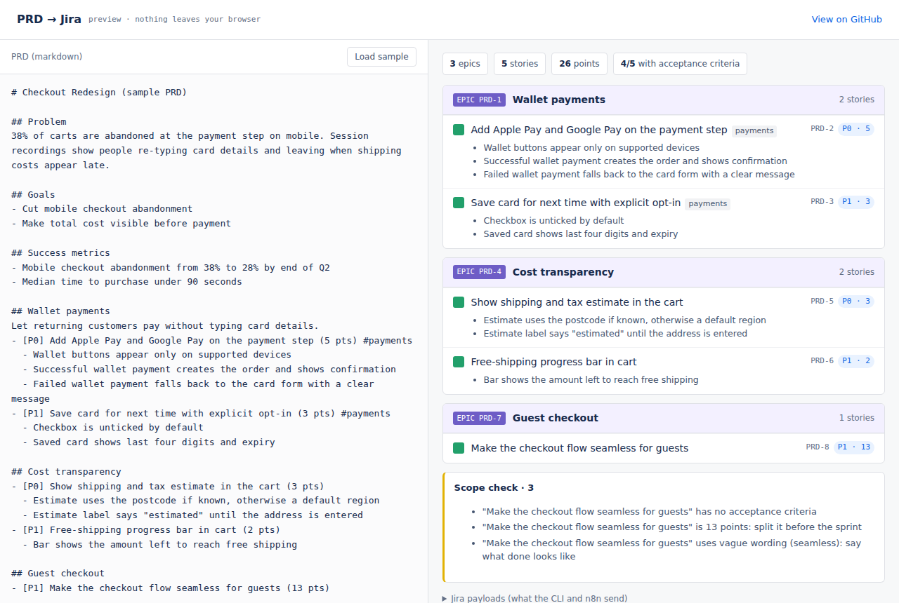

# prd-to-jira

**Turn a PRD into scoped Jira epics and stories, with a scope check before anything reaches the backlog.** One parser, three ways to run it: a CLI, an importable n8n workflow, and a browser preview.

**[Try the preview →](https://murtuzabuilds.github.io/prd-to-jira/)** &nbsp;·&nbsp; paste any PRD, see the tickets it becomes



## Why

Turning a requirements doc into Jira work is slow, manual and lossy. Acceptance criteria get dropped, oversized stories slip into sprints, and "make it seamless" becomes a ticket nobody can close. This tool does the translation and flags those problems while the PRD is still cheap to fix.

## Write the PRD like this

```markdown
# Checkout Redesign

## Problem / ## Goals / ## Success metrics / ## Out of scope / ## Risks
(recognized as context, never turned into tickets)

## Wallet payments                                   ← each other ## heading is an epic
- [P0] Add Apple Pay and Google Pay (5 pts) #payments ← each top-level bullet is a story
  - Wallet buttons appear only on supported devices   ← nested bullets are acceptance criteria
  - Failed wallet payment falls back to the card form
```

`[P0]`–`[P3]` sets priority (mapped to Highest…Low), `(5 pts)` sets the estimate, `#label` adds labels.

## Scope check

Every run lints the plan before it can be pushed:

| Check | Why it matters |
|---|---|
| Story over 8 points | Too big for a sprint. Split it first |
| Story without acceptance criteria | Nobody can agree when it's done |
| Vague wording (*seamless, intuitive, fast, improve…*) | Say what done looks like instead |
| No Goals section | Tickets won't trace back to an outcome |
| Success metrics with no number | Not a metric |
| No epics or no title | Errors block the push entirely |

## 1 · CLI

```bash
git clone https://github.com/murtuzabuilds/prd-to-jira && cd prd-to-jira
npm run plan                                         # preview the sample PRD, no Jira needed
node bin/prd2jira.js plan your-prd.md --json         # machine-readable plan

export JIRA_BASE_URL=https://your-team.atlassian.net
export JIRA_EMAIL=you@company.com
export JIRA_API_TOKEN=...                            # id.atlassian.com → Security → API tokens
node bin/prd2jira.js push your-prd.md --project SHOP --points-field customfield_10016
```

```
Checkout Redesign
3 epics · 5 stories · 26 points · 4/5 with acceptance criteria

▸ EPIC  Wallet payments
    P0  Add Apple Pay and Google Pay on the payment step  5 pts · 3 AC
    P1  Save card for next time with explicit opt-in      3 pts · 2 AC
▸ EPIC  Cost transparency
    P0  Show shipping and tax estimate in the cart        3 pts · 2 AC
    P1  Free-shipping progress bar in cart                2 pts · 1 AC
▸ EPIC  Guest checkout
    P1  Make the checkout flow seamless for guests        13 pts

Scope check
  ! "Make the checkout flow seamless for guests" has no acceptance criteria
  ! "Make the checkout flow seamless for guests" is 13 points: split it before the sprint
  ! "Make the checkout flow seamless for guests" uses vague wording (seamless)
```

Epics are created first, then each story is linked to its epic with `parent`, which works in both team-managed and company-managed projects. Acceptance criteria land in the story description as a proper list.

## 2 · n8n workflow

[`n8n/prd-to-jira.workflow.json`](n8n/prd-to-jira.workflow.json) is ready to import (**Workflows → Import from file**):

```
Webhook (POST prd + project) → Parse PRD → Create epic → Expand stories → Create story → Summary → Respond
```

Add your Jira Cloud credential to the two Jira nodes, then:

```bash
curl -X POST https://your-n8n/webhook/prd-to-jira \
  -H 'content-type: application/json' \
  -d "{\"project\":\"SHOP\",\"prd\":$(jq -Rs . < your-prd.md)}"
```

The **Parse PRD** Code node is generated from `src/parse.js` (`npm run build:n8n`), so the CLI, the preview and the workflow can never disagree about what a PRD means.

## 3 · Browser preview

`index.html` runs the same parser client-side. It's useful for writing a PRD with the scope check live beside it. Nothing is sent anywhere.

## Layout

```
src/parse.js            PRD → plan, plus the scope check (pure, no dependencies)
src/jira.js             Jira REST v3 payloads, ADF descriptions, create epics then stories
bin/prd2jira.js         CLI
n8n/                    importable workflow (generated)
scripts/build-n8n.js    embeds the parser into the workflow
index.html              browser preview
examples/               a sample PRD
tests/                  6 tests, node's built-in runner
```

```bash
npm test
```

---

Built by [Murtuza](https://murtuzabuilds.com). MIT licensed. The sample PRD is made up.
